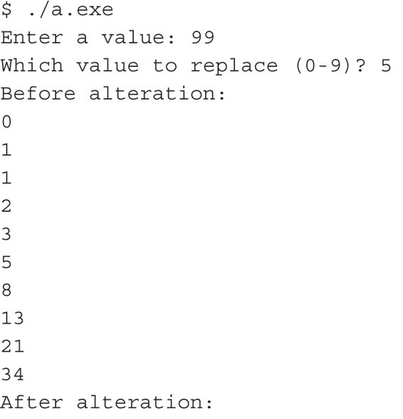
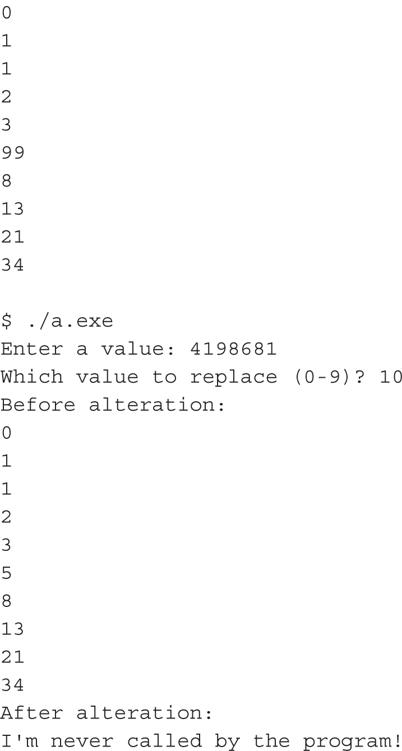

## Buffer overflows - Tips and Tricks

Documentation:

* **The Shellcoder's Handbook: Discovery and Exploiting Security Holes** by *Chris Anley, Felix Linder, and Gerardo Richarte**
* **Smashing stack for Fun and Profit** - http://phrack.org/issues/49/14.html
* **Once upon a free** - http://phrack.org/issues/57/9.html
* **Advanced Doug Lea's Malloc Exploits** - http://phrack.org/issues/61/6.html
* https://www.corelan.be/index.php/2009/07/19/exploit-writing-tutorial-part-1-stack-based-overflows/
* https://www.corelan.be/index.php/2009/09/05/exploit-writing-tutorial-part-5-how-debugger-modules-plugins-can-speed-up-basic-exploit-development/

## ICS

  * https://ics-cert.us-cert.gov/advisories/ICSA-15-111-02
  * https://ics-cert.us-cert.gov/advisories/ICSA-15-120-01
  * https://ics-cert.us-cert.gov/advisories/ICSA-15-097-01
  * https://ics-cert.us-cert.gov/advisories/ICSA-15-092-01
  * https://ics-cert.us-cert.gov/advisories/ICSA-15-071-01
  * https://ics-cert.us-cert.gov/advisories/ICSA-15-069-03
  * https://ics-cert.us-cert.gov/advisories/ICSA-11-091-01A


## Basics

Example1:

```CPP
#include <stdio.h>

int main()
{
	int x = 0;
	char buffer[6];
	gets(buffer);
	
	printf("%i\n", x);
}
```

```bash
$ gcc main.c -o main
$ ./main
AAAAAAAAAAAAAAAAAAAAAAAAAAAA
0
*** stack smashing detected ***: ./main terminated
Aborted (core dumped)

```

Pointers manipulation:

```CPP
#include <stdio.h>

void print_list(int *list)
{
	int i;
	
	for(int i=0; i lower 10; i++)	// 10 items list hardcoded
		printf("%i\n", list [i]);
}

// Function which is never called
void bad_function(int *blah)
{
	printf("I'm never called by the rogram!");
}

int main()
{
	void (*fn)(int*); // pointer to a function that expects an int* parameter
	
	int items[10] = {0, 1, 2, 2, 3, 5, 8, 13, 21, 34};
	
	int i;
	int val;
	fn = print_list;
	
	printf("Enter a value: ");
	scanf("%i", &val);
	printf("Which value to replace (0-9)?");
	scanf("%i", &i);
	
	printf("Before alteration:\n");
	fn(items);	// call function tat fn points to
	
	items[i] = val;
	
	printf("After alteration:\n");
	fn(items);	// call function again
	
	return 0;	
}
```

*The example may be a bit contrived, but it demonstrates the issue. Look at the following executions of the program. The first receives expected input; the second is not so expected.*




*As you can see, the results are quite different. Even though the bad_fn() function is never called, it still executed in the second run. Now, if you run this exact code and input, things probably won’t go as smoothly for you. The key is in that seemingly magic number, 4198681. Where the heck did we come up with 4198681? It happens to be the decimal (base 10) representation of 0x00401119. We found that number through using objdump (objdump -D <program name>) and gdb to disassemble the target program and figure out where bad_fn() lives. Then we converted the hexadecimal number to decimal because that’s what scanf() expects. objdump and gdb are handy little Linux utilities used for disassembling and debugging programs. They’re powerful, but they use a command-line interface only. They may not be terribly friendly to beginners. In a live system, this “magic” value might be found by a hacker in the same way—if they have a copy of the executable and it was compiled to always load the function into the same memory address (versus being relocatable). Alternatively, a hacker might run multiple attempts against the target to find values that yield interesting results (see Chapter 7 for a discussion on fuzzing and debuggers and what other tools might be better suited to this task).
This toy example demonstrates one of the many ways in which controlling the value of a pointer can lead to some bad/interesting results (depending on your perspective). With a random value, the target program will likely just crash. Alternately, a value could be used to bypass a security protection that gets checked before a sensitive operation is performed (by jumping into the middle of the function), or a value could be used to point to a data buffer that the attacker controls, leading to an arbitrary code execution exploit.*

**HACKING EXPOSED: ICS and SCADA Security Secrets and Solutions** by *C. E. Bodungen, B. L. Singer, A. Shbeeb, S. Hilt, K. Wilhoit*

## Protection?

Control you memory better!

and some sort of crazy integers overflow protection

```CPP
// Dangerous
if(val1 + val2 < MAX_INT)
{
	//bla
}

// Safe
if(val2 < MAX_INT - val1)
{
	//bla
}
```
