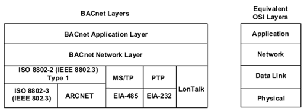

## BACnet



This is the UDP Port number used by BACnet communications over IP. The common default value is 0xBAC0 or **47808**. 0xBAC1 or **47809** is common too, although there is no requirement to limit the port to these values. In fact, the new BACnet Port Object requires support in the ranges *47808 - 47823 (0xBAC0 - 0xBACF) and 49152 - 65535*. (The range *49152 - 65535* is the 'dynamic port' range). 

## Simulators

http://bacnet.sourceforge.net/ -> http://bacnet4linux.sourceforge.net/

Download -> UnTar then

```bash
$ make clean all
$ sudo ./bacnet4linux -D4 -m2 -p5555 -v5556 
```

Then access: http://localhost:8000/

## Scan

Use nmap to identify the device:

```bash
nmap --script bacnet-info -sU -p 47808 10.0.0.1
```

or shodan with dork:

```port:47808```